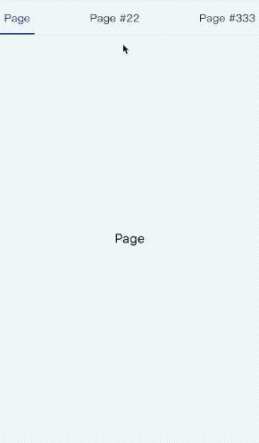
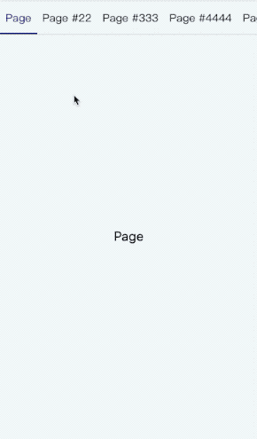

# react-underline-tabbar
[View README in English](./README.md)  

**Tab, underlined, auto scrolling**

## Install
```
npm install react-underline-tabbar --save
```

## Introduction
Tabs component supporting RN side and web side  
Provide an underscore to follow the selected tab, and adapt to the width or height of its tab  
You can pass the Animated animation value listener to do the motion synchronization. If you don't pass it, you can also provide the animation value. You can set the duration.  
You can pass the relevant style to determine the container style according to your needs.  
RN and Web support adaptive scrolling, scrolling when the width of the tab exceeds the container, and setting the corresponding scroll style, otherwise the default use of justifyContent: space-between style full container, you can change the default style by setting scrollViewStyle  
You can use the width/height in the underlineStyle to give the underline a fixed size. If you exceed the container size, you can ignore it. You can set the isAutoSize to restore the automatic size when the tabBar is scrollable.  

## Note
based on[react-native-underline-tabbar](https://github.com/Slowyn/react-native-underline-tabbar)The RN component library draws on the animation of the underlined part. Based on this, the scrolling and onLayout code is optimized, and the web component is developed. If you are interested, you can go and see it.  
Tabs view synchronization animation can be done with react-scroll-paged-view  

## Demo
| Tab | Scroll Tab |
| --- | ---------- |
|  |  |

## Usage
Combination can be used with react-scroll-paged-view  

```javascript
import ScrollPagedView from 'react-scroll-paged-view'
import InsideScrollView from './InsideScrollView'

...
    render() {
        return (
          <View style={styles.containerWrap}>
            <ViewPaged
              vertical={false}
              renderHeader={params => (
                <TabBar
                  tabs={this.tabs}
                  tabStyle={styles.tab}
                  {...params}
                />
              )}
            >
              {this.tabs.map(({ label, text }, index) => (
                <Page key={index} tabLabel={{ label }} label={text || label}/>
              ))}
            </ViewPaged>
        )
    }
...
```

## Export module
- default - TabBar

## Porps
| Name | propType | default value | description |
| --- | --- | --- | --- |
| tabs | array | [] | Tab information array, at least provide label attribute display |
| pos | animated | null | Animated value, used as a listener |
| width | number | undefined | Scroll view width |
| width | number | undefined | Scroll view height |
| goToPage | function | noop | Switch tab function, the parameter is tab index |
| activeTab | number | 0 | Currently activated tab index |
| renderTab | function/element | null | Render tab component |
| scrollPosition | string | center | Scroll positioning, the default scroll to the middle, other optional values are 'prev', 'next', respectively, the difference between the previous tab or the next tab |
| hasUnderline | bool | true | Is there an underline? |
| scrollEnabled | bool | true | Is it possible to manually scroll the tabBar? |
| hasAnimation | bool | true | Is there an animation when switching tabs? |
| duration | number | 400 | Animation duration when pos is not provided(In milliseconds) |
| style | object | {} | Outer container style |
| scrollViewStyle | object | {} | Scrolling container style |
| underlineStyle | object | {} | Underline style |
| tabStyle | object | {} | Tab item style |
| tabActiveStyle | object | {} | Activated tab item style |
| tabTextStyle | object | {} | Tab item text style |
| tabTextActiveStyle | object | {} | Activated tab item text style |
| vertical | bool | true | Whether to show tabs in the vertical direction |
| isAutoSize | bool | false | Whether to restore the automatic size when the tabBar can be scrolled when the underline size value is set |

## TODO
- [x] Optimize the scrolling animation code to remove the dependency of Animated.divide (the web-side animated library does not support it)
- [x] Provide web-side version, unified props, consistent with RN
- [x] Provides its own animation, when no animation values are passed in
- [x] Add automatic scrolling positioning configuration
- [ ] Fix the problem of switching animation violations again after manual scrolling
- [x] Provide friendly tabbed form without scrolling
- [ ] More props configuration
- [x] Add a configuration that shows tabs vertically
- [x] Provides settings related to the fixed size of the slide line

## Changelog
- 1.0.*

### 1.0.3+
- Fixed an issue where recalculating animation map values when automatically switching scrolling elements
- Add automatic scrolling positioning configuration

### 1.0.5+
- Fix the bottom line misalignment bug caused by the use of matrix3d on some mobile phones in h5

### 1.1.0+
- Increase the vertical display tab configuration vertical

### 1.1.2+
- Increase fixed downline related configuration isAutoSize

### 1.1.4+
- Fixing as a separate component without passing in width/height causes the glide to not follow the bug
- Fix the flex attribute of the incoming tabStyle when not scrolling
