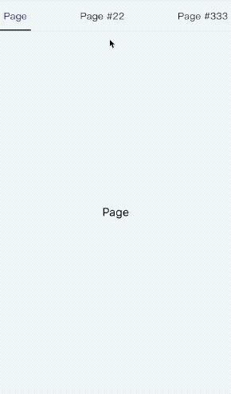
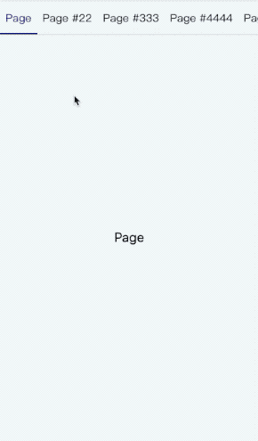

# react-underline-tabbar
[View README in English](./README.md)  

**选项卡，下划线跟随，自动滚动**

## 安装
```
npm install react-underline-tabbar --save
```

## 简介
支持RN端和的web端的tabs组件  
提供下划线跟随选中tab，及适应其tab的宽度或高度  
可以传入Animated动画值监听做动作同步，未传入自身也提供动画值，可以设置持续时间  
可以依据自身需要传入相关style确定容器样式  
RN和Web端支持自适应滚动，当tab的宽度超过容器时才发生滚动，并设置相应的滚动样式，否则默认使用justifyContent: space-between样式充满容器，可以通过设置scrollViewStyle改变默认样式  
可以通过传入underlineStyle中的width/height给予下划线固定尺寸，超出容器尺寸时忽略，可以通过设置isAutoSize使在tabBar可滚动时恢复为自动尺寸  

## 注意
基于[react-native-underline-tabbar](https://github.com/Slowyn/react-native-underline-tabbar)RN组件库，借鉴了下划线部分的动画处理，在此基础上优化了滚动和onLayout的代码，并开发了web组件，感兴趣的可以去看下  
可以配合react-scroll-paged-view来做tabs视图同步动画  

## Demo
| Tab | Scroll Tab |
| --- | ---------- |
|  |  |

## 使用
结合可以配合react-scroll-paged-view使用  

```javascript
import ScrollPagedView from 'react-scroll-paged-view'
import InsideScrollView from './InsideScrollView'

...
    render() {
        return (
          <View style={styles.containerWrap}>
            <ViewPaged
              vertical={false}
              renderHeader={params => (
                <TabBar
                  tabs={this.tabs}
                  tabStyle={styles.tab}
                  {...params}
                />
              )}
            >
              {this.tabs.map(({ label, text }, index) => (
                <Page key={index} tabLabel={{ label }} label={text || label}/>
              ))}
            </ViewPaged>
        )
    }
...
```

## Export module
- default - TabBar

## 属性
| Name | propType | default value | description |
| --- | --- | --- | --- |
| tabs | array | [] | tab信息数组，至少提供label属性展示 |
| pos | animated | null | animated值，用作监听 |
| width | number | undefined | 滚动视图的width |
| width | number | undefined | 滚动视图的height |
| goToPage | function | noop | 切换tab函数，参数为tab索引 |
| activeTab | number | 0 | 当前激活的tab索引 |
| renderTab | function/element | null | 渲染tab组件 |
| scrollPosition | string | center | 滚动定位，默认滚动到中间，其他可选值为'prev'、'next'，分别为相差上一个tab或下一个tab定位 |
| hasUnderline | bool | true | 是否有下划线 |
| scrollEnabled | bool | true | 是否可以手动滚动tabBar |
| hasAnimation | bool | true | 切换tab时是否有动画 |
| duration | number | 400 | 未提供pos时的动画持续时间(以毫秒为单位) |
| style | object | {} | 最外层容器样式 |
| scrollViewStyle | object | {} | 滚动容器样式 |
| underlineStyle | object | {} | 下划线样式 |
| tabStyle | object | {} | tab项样式 |
| tabActiveStyle | object | {} | 激活的tab项样式 |
| tabTextStyle | object | {} | tab项文字样式 |
| tabTextActiveStyle | object | {} | 激活的tab项文字样式 |
| vertical | bool | true | 是否为垂直方向展示tab |
| isAutoSize | bool | false | 当设置下划线尺寸值时，是否在tabBar可以滚动的情况下恢复使用自动尺寸 |

## TODO
- [x] 优化滚动动画代码，去除Animated.divide的依赖（web端animated库不支持）
- [x] 提供web端版本，统一props，表现和RN一致
- [x] 提供自身动画处理，在未传入动画值时
- [x] 添加自动滚动定位配置
- [ ] 修复手动滚动后再次切换动画违和的问题
- [x] 提供友好的不带滚动的tab形式
- [ ] 更多props配置
- [x] 添加可垂直方向展示tab的配置
- [x] 提供下滑线固定尺寸相关的设置

## Changelog
- 1.0.*

### 1.0.3+
- 修复自动切换滚动元素时重新计算动画映射值的问题
- 添加自动滚动定位配置

### 1.0.5+
- 修复h5部分手机使用matrix3d导致的底线错位bug

### 1.1.0+
- 增加垂直方向展示tab的配置vertical

### 1.1.2+
- 增加固定下滑线相关配置isAutoSize

### 1.1.4+
- 修复作为独立组件时未传入width/height导致下滑线不跟随bug
- 修复未滚动时可以使用传入tabStyle的flex属性
